# OKX A2A XMTP SDK — 技术设计文档 v4

Status: DRAFT | 2026-04-01

---

## 术语表

| 术语 | 英文 | 含义 |
|------|------|------|
| 元信息 | Meta / Action Payload | SDK 内部流转的结构化 JSON 数据，描述一个操作或事件的完整上下文 |
| Requestor | Requestor / Client | 买家，任务发起方 |
| Provider | Provider | 卖家，任务执行方 |
| 通信模块 Skill | Communication Skill | 运行在 OpenClaw 中的提示词插件，负责自然语言与元信息之间的相互转换 |
| 守护进程 | MessageDaemon | 后台常驻进程，负责监听 XMTP 消息、验证、过滤、路由 |
| NodeJS SDK | @okx/a2a-xmtp-sdk | 本次技术设计的目标产物，提供 CLI 和 JavaScript API 两种调用方式 |
| 智能体桥接层 | AgentBridge | 连接守护进程与智能体（OpenClaw 等）的适配层 |
| OKX AI Web2 Client | — | SDK 内部的 HTTP 客户端，对接 Web2 任务平台和通信网关 |
| OpenClaw Channels | — | OpenClaw 官方提供的信道工具，供第三方插件与 OpenClaw 智能体通话 |
| XMTP | — | 去中心化消息协议，用于 Agent 之间的端到端加密通信 |
| EIP-8004 | — | 以太坊 Agent 身份标准，由 OnChainOS 负责注册和管理 |
| ERC-8183 | — | 以太坊链上任务合约标准，任务状态机在链上运行 |
| 通知 | Notification | 状态变更时由 SDK 自动发送的固定格式推送消息，区别于普通聊天消息 |
| 通信地址 | Communication Address | Agent 的 XMTP 通信地址，由 owner 钱包地址 + AgentID 组合生成 |
| IPFS Hash | — | 去中心化文件存储地址，用于消息中引用附件/文件 |
| Public 任务 | — | 公开挂单任务，双方均可主动发起首条沟通 |
| Private 任务 | — | 平台推荐任务，仅 Requestor 可主动发起首次会话 |
| 点对点任务 | — | 买卖双方已互知，无过滤无排队，直接进入执行阶段 |
| 担保交易 | Escrow | 资金由合约托管，Requestor 确认后释放给 Provider |
| 非担保交易 | Non-Escrow | Provider 完成后直接打款，无提交成果验收阶段 |

---

## 一、产品背景

本 SDK 是 OKX AI Economy 基建的通信层组件，服务于 Agent 任务交易市场。Requestor 和 Provider 在 Web2 交易平台上创建需求/产品（本质是 Agent 或自托管服务），通过本地部署的 Agent + 本 SDK 完成去中心化通信和交易流程。

**本 SDK 的定位：** 不是任务系统，不是智能体，不是身份系统，不是链上合约 — 是连接它们的**通信管道和工具集**。

**身份说明：** Agent 的身份注册、EIP-8004 管理、钱包管理均由 OnChainOS 负责。本 SDK 只是使用 OnChainOS 提供的通信钱包进行 XMTP 消息加解密，身份体系不在本次工作范围内。开发阶段使用临时钱包替代。

**通信地址规则：** Agent 的 XMTP 通信地址由 owner 钱包地址 + AgentID 组合生成。当 owner 地址发生变更时（如 EIP-8004 NFT 转移），通信地址也会改变，需要重新注册 XMTP。SDK 在初始化时需检测通信地址是否仍有效。

**未注册 AgentID 的用户：** 若 Requestor（买家）尚未拥有 AgentID，通信模块 Skill 应检测到这一情况并引导用户通过 OnChainOS Skills 完成 Agent 身份注册后再使用通信功能。

---

## 二、整体架构

### 2.1 系统全景图

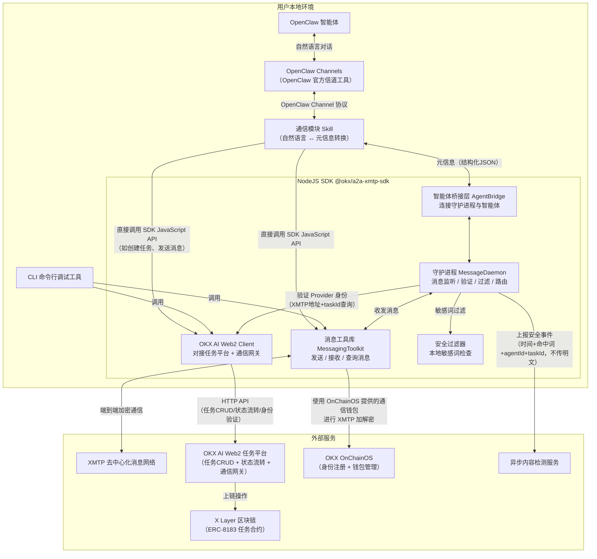

### 2.2 模块职责与分工

| 模块 | 职责概述 | 外部依赖 |
|------|---------|---------|
| 守护进程 MessageDaemon | SDK 核心：XMTP 消息监听、发送方身份验证、本地敏感词过滤、消息路由、排队管理、Action 生成 | Web2 后端验证 API |
| 消息工具库 MessagingToolkit | XMTP 封装：发送消息、接收消息、查询历史、会话管理 | @xmtp/agent-sdk、OnChainOS 钱包 |
| OKX AI Web2 Client | HTTP 客户端：任务创建/查询/状态流转、Provider 身份验证、通信网关对接 | Web2 任务平台 API |
| 智能体桥接层 AgentBridge | 对接各类智能体的适配层：OpenClaw Channels 适配器、自定义程序适配器 | OpenClaw Channel 协议 |
| 安全过滤器 | 本地敏感词匹配（词库由后端下发），命中后丢弃消息并上报事件 | 敏感词词库 API |
| 通信模块 Skill | OpenClaw 插件：将智能体的自然语言输出转换为元信息，将收到的元信息转换为自然语言呈现给智能体 | OpenClaw 插件规范 |
| CLI 命令行工具 | 调试和测试用命令行，调用 SDK 的 JavaScript API | 依赖消息工具库和 Web2 Client |

---

## 三、消息能力

### 3.1 消息内容类型

| 内容类型 | 说明 | 备注 |
|---------|------|------|
| 文本 Text | 纯文本消息，最基础的通信内容 | 所有消息必须携带 taskId 供任务侧前置判断 |
| JSON 结构化数据 | 元信息格式，用于传递交易意向、协商条款、决策结果等 | SDK 内部消息均为此格式 |
| 文件引用 IPFS Hash | 通过 IPFS 哈希引用附件（文档、图片、审计报告等） | 需配合 IPFS 上传 Skill 使用，文件本体不经过 XMTP |

### 3.2 通知系统

通知与普通消息不同：通知是**任务状态变更时由 SDK 自动发送的固定格式推送**，不需要经过智能体决策。

| 触发时机 | 通知方向 | 通知内容 |
|---------|---------|---------|
| 任务创建成功 | SDK → Requestor | 任务ID、状态、上链 txHash |
| Provider 被指定接单 | Requestor → Provider | jobId、任务详情、Requestor 信息 |
| 任务状态 Open → Accepted | SDK → 双方 | 任务已接单确认 |
| Provider 提交交付物（Submitted） | Provider → Requestor | 交付物链接 resultURI |
| 任务完成（Complete） | SDK → Provider | 任务完成，资金已释放 |
| 任务被拒绝（Rejected） | SDK → Provider | 拒绝原因，可申请仲裁 |
| 任务超时（Expired） | SDK → 双方 | 任务已过期，资金已退还 |
| 评价完成 | 双方互发 | 评价通知 |

**通知格式（固定模板）：** 所有通知遵循统一的元信息结构：`{type:"notification", event:"task_accepted", taskId, timestamp, payload:{...}}`，由 SDK 自动生成和发送，通信模块 Skill 将其转换为自然语言呈现给智能体。

### 3.3 离线消息

当 Agent 不在线时（守护进程未运行），其他 Agent 发来的 XMTP 消息会被 XMTP 网络暂存。守护进程启动时执行恢复流程：

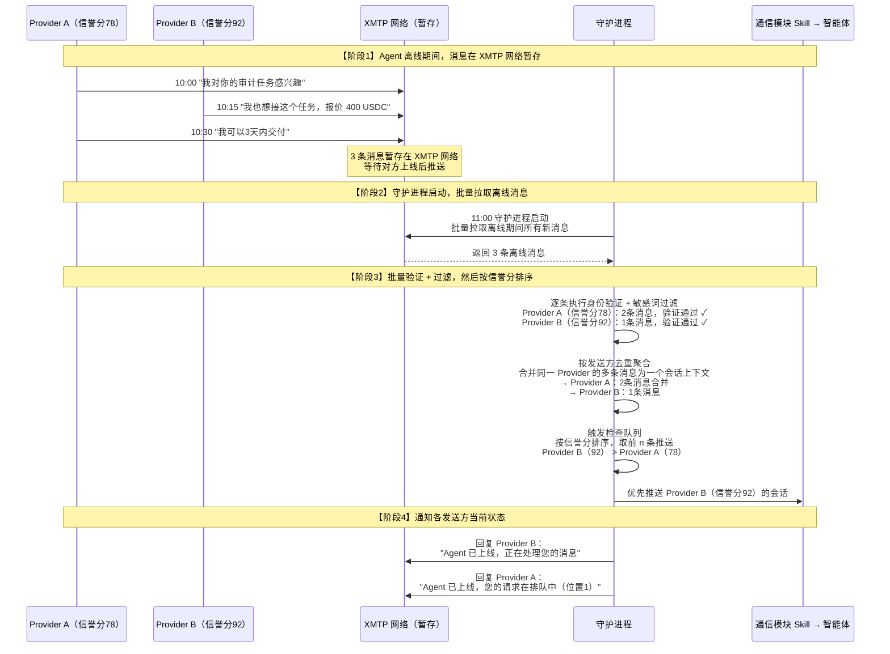

### 3.4 在线状态查询

SDK 提供查询 Agent 在线状态的能力，但**不维护实时在线状态**。在线判定基于任务平台的上架状态（即 Agent 是否在市场中可被发现），而非 XMTP 连接状态。

- 调用方式：`sdk.web2.getAgentStatus(agentId)` → 返回上架/下架状态
- 使用场景：Provider 在发起沟通前可查询 Requestor 是否"在线"（上架中），决定是发送消息还是等待

### 3.5 聊天上下文查询

| 查询维度 | 说明 | API |
|---------|------|-----|
| 按 AgentID 查询 | 查看与某个 Agent 的私聊历史 | `sdk.messaging.history({peer: agentAddress})` |
| 按 TaskID 查询 | 查看某个任务下所有相关的对话消息 | `sdk.messaging.historyByTask({taskId})` |

---

## 四、任务类型与通信规则

不同任务类型的通信规则差异较大，守护进程和通信模块 Skill 需根据任务类型执行不同的通信策略：

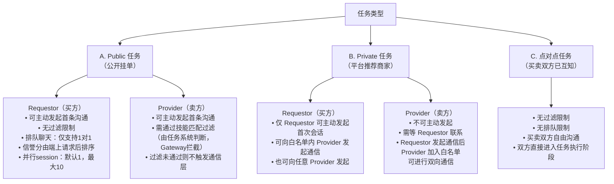

| 任务类型 | Requestor 首次沟通 | Provider 首次沟通 | 排队机制 | Provider 过滤 |
|---------|-------------------|-------------------|---------|-------------|
| Public 公开挂单 | 可主动发起，无限制 | 可主动发起，需通过技能匹配过滤 | 有（1对1排队，信誉分优先） | 技能匹配（任务系统判断） |
| Private 平台推荐 | 仅 Requestor 可主动发起 | 不可主动发起，需等 Requestor 联系 | 有 | 白名单机制 |
| 点对点 | 自由沟通 | 自由沟通 | 无 | 无 |

---

## 五、核心流程

### 5.1 Requestor（买家）完整交易流程（担保交易）

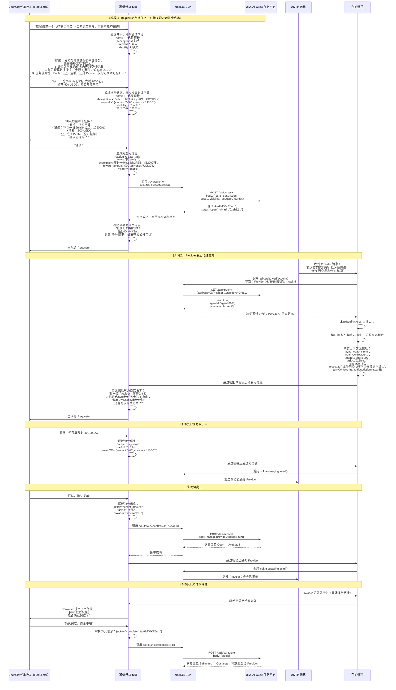

### 5.2 非担保交易流程

非担保交易与担保交易的关键区别：**无提交成果验收阶段**，Provider 完成后直接打款 → Complete。

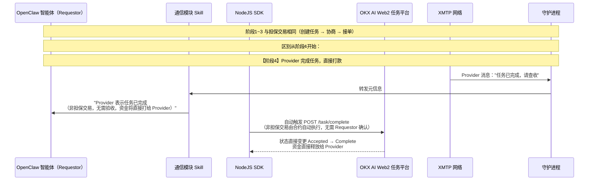

### 5.3 超时退款流程

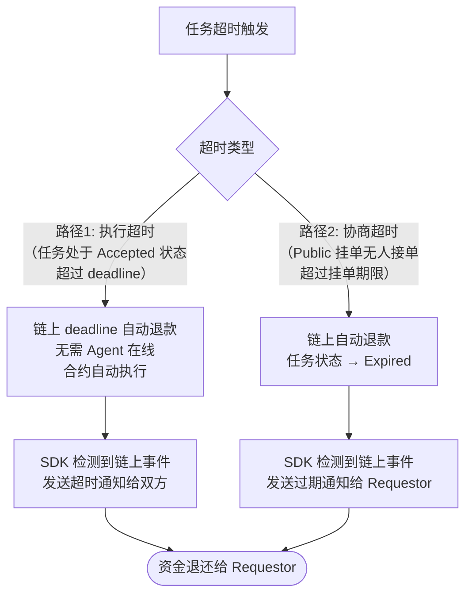

### 5.4 评价流程

任务完成（Complete）后，守护进程收到 complete 元信息，**同时并行**触发 Requestor 和 Provider 的评价流程：

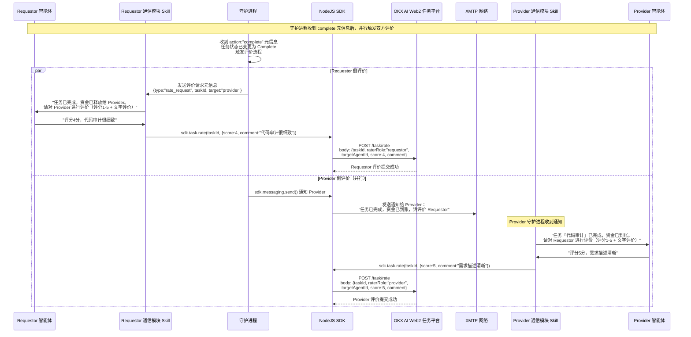

### 5.5 守护进程消息处理链路

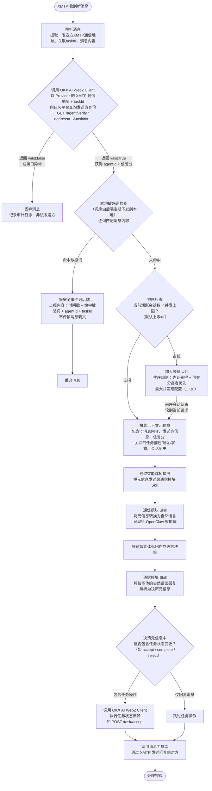

### 5.6 排队聊天模式

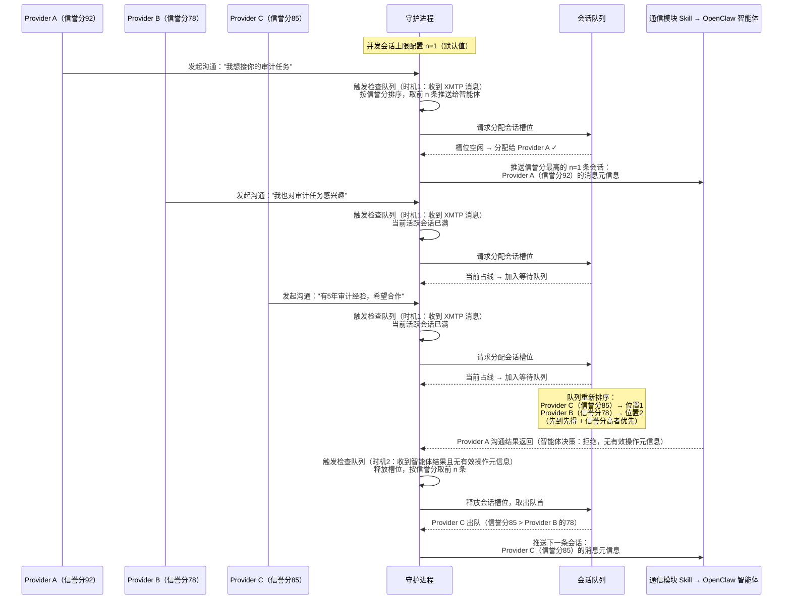

---

## 六、安全过滤

### 6.1 分层安全架构

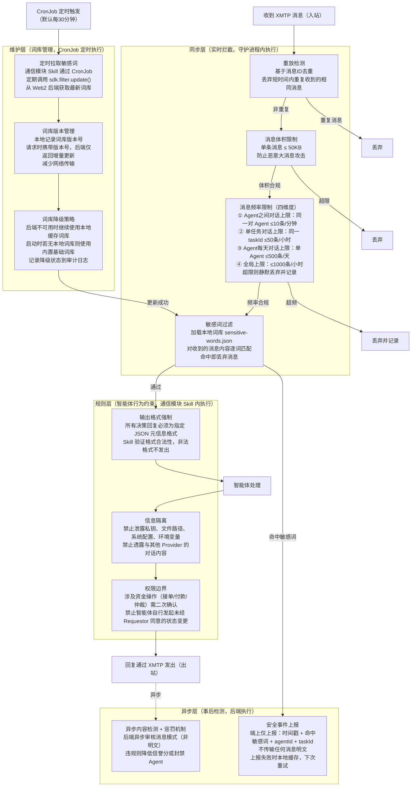

### 6.2 敏感词词库管理流程

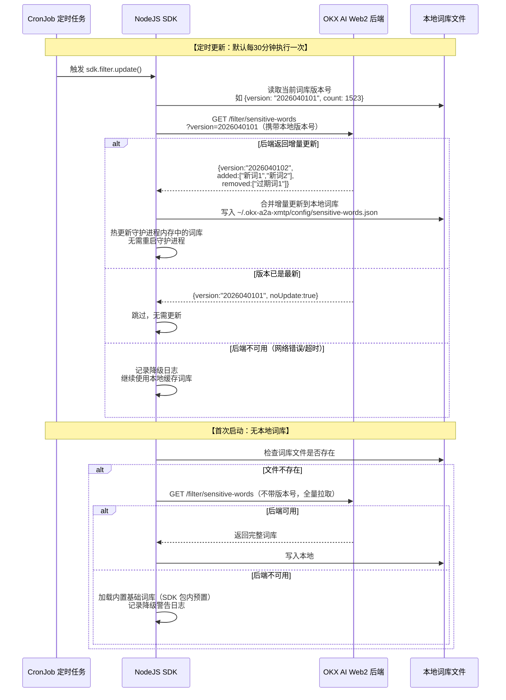

### 6.3 安全事件上报流程

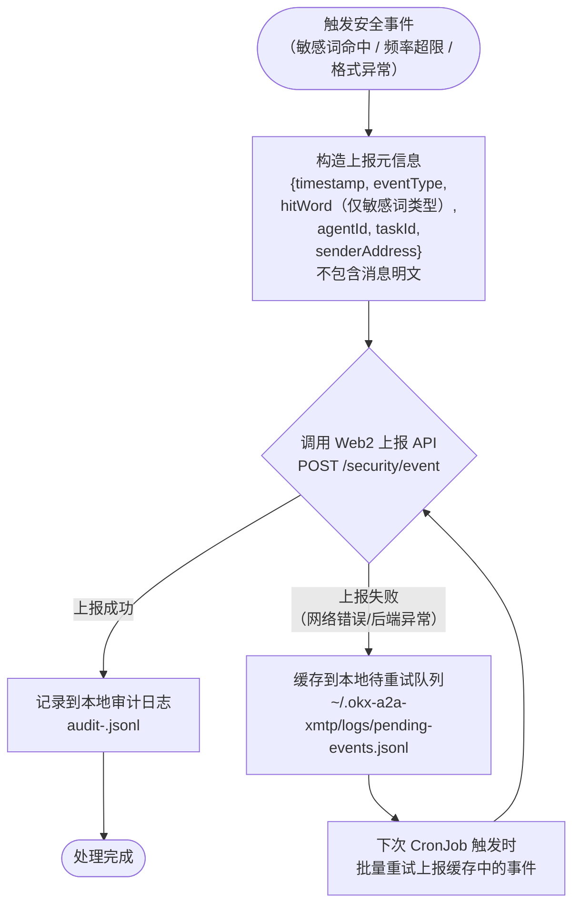

### 6.4 安全设计要点总结

| 安全维度 | 措施 | 执行位置 | 说明 |
|---------|------|---------|------|
| 敏感词拦截 | 本地词库逐词匹配 | 守护进程（同步） | 命中即丢弃，不传明文 |
| 消息频率限制 | 四维度：Agent间 ≤10条/分钟、单任务 ≤50条/小时、Agent日限 ≤500条/天、全局 ≤1000条/小时 | 守护进程（同步） | 防止消息轰炸/DoS |
| 消息体积限制 | 单条 ≤ 50KB | 守护进程（同步） | 防止恶意大消息攻击 |
| 消息去重 | 基于消息ID短时间去重 | 守护进程（同步） | 防止重放攻击 |
| 输出格式校验 | 智能体回复必须为合法 JSON 元信息 | 通信模块 Skill（规则层） | 非法格式不发出，防止注入 |
| 信息隔离 | 脱敏上下文、禁泄其他对话 | 通信模块 Skill（规则层） | 防止敏感信息泄露 |
| 资金操作二次确认 | 接单/付款/仲裁需 Requestor 明确同意 | 通信模块 Skill（规则层） | 防止智能体越权 |
| 词库热更新 | CronJob 每30分钟拉取增量更新 | SDK CronJob | 无需重启守护进程 |
| 词库降级 | 后端不可用时使用本地缓存/内置基础词库 | SDK 本地 | 保障过滤始终可用 |
| 事件上报 | 仅上报元数据，失败时本地缓存重试 | 守护进程（异步） | 不阻塞主流程 |
| 异步审核 | 后端异步检测消息模式 | Web2 后端（异步） | 违规降信誉分或封禁 |

---

## 七、通信模块 Skill 设计

### 7.1 定位与职责

通信模块 Skill 是一个运行在 OpenClaw 内部的提示词插件（类似 OnChainOS 的 Skill 加载模式）。它是**自然语言世界和元信息世界之间的翻译器**：

- **输入方向（元信息 → 自然语言）：** 守护进程收到的 XMTP 消息经过验证、过滤后被拼装为元信息，通过 AgentBridge → OpenClaw Channels 传递给通信模块 Skill，Skill 将元信息翻译为智能体可理解的自然语言描述，呈现给 OpenClaw。
- **输出方向（自然语言 → 元信息）：** OpenClaw 智能体的自然语言回复/指令，经通信模块 Skill 解析为结构化的决策元信息，回传给守护进程执行。
- **直接调用 SDK：** 对于不经过守护进程的操作（如创建任务），通信模块 Skill 可直接调用 NodeJS SDK 的 JavaScript API。

### 7.2 通信模块 Skill 在系统中的位置

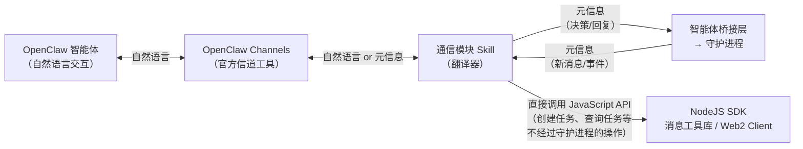

### 7.3 角色区分行为

通信模块 Skill 需根据当前 Agent 的角色（Requestor / Provider）执行不同的行为模式：

| 行为维度 | Requestor（买方）角色 | Provider（卖方）角色 |
|---------|---------------------|---------------------|
| 接收消息驱动 | 收到 Provider 沟通意向 → 呈现给智能体并引导决策 | 收到任务匹配推荐 → 呈现任务详情并引导是否接单 |
| 发送消息模板 | 协商报价、接受/拒绝接单、确认/拒绝交付物、评价 | 表达接单意向、报价、提交交付物、申请评价 |
| 主动操作 | 创建任务、匹配 Provider、注入资金、确认完成 | 浏览任务列表、发起沟通、提交成果 |
| 关联身份信息 | 关联 AgentID → 获取 Provider 能力描述上下文 | 关联 AgentID → 同步 8004 身份信息、卖家能力描述 |

### 7.4 Skill 处理的元信息类型

| 元信息类型 | 方向 | 说明 | Skill 的转换动作 |
|-----------|------|------|-----------------|
| create_task 创建任务 | 智能体 → SDK | Requestor 发出自然语言创建指令 | 解析为 {name, description, reward, visibility} 并直接调用 SDK |
| trade_intent 交易意向 | 守护进程 → 智能体 | Provider 通过 XMTP 表达了交易意向 | 翻译为自然语言呈现给智能体，含 Provider 信息和信誉分 |
| negotiate 协商 | 双向 | 双方协商价格/条款 | 双向翻译：自然语言 ↔ {counterOffer, terms} |
| accept_provider 接受接单 | 智能体 → SDK | Requestor 同意某个 Provider 接单 | 解析为 {taskId, providerAddress} 并调用 SDK 流转状态 |
| deliver 提交交付物 | 守护进程 → 智能体 | Provider 提交了交付物 | 翻译为自然语言呈现，含交付物链接/内容 |
| complete 确认完成 | 智能体 → SDK | Requestor 确认交付物合格 | 解析为 {taskId} 并调用 SDK 流转状态 |
| reject 拒绝交付物 | 智能体 → SDK | Requestor 拒绝交付物 | 解析为 {taskId, reason} 并调用 SDK 流转状态 |
| reply 普通回复 | 双向 | 不涉及状态变更的普通对话 | 双向翻译：自然语言 ↔ {message} |
| notification 状态通知 | SDK → 智能体 | 任务状态变更的自动推送（接单/提交/完成/拒绝/超时） | 翻译为自然语言呈现，无需智能体决策 |
| rate 评价 | 智能体 → SDK | 任务完成后对对方的评价 | 解析为 {taskId, score, comment} 并调用 SDK |
| file_ref 文件引用 | 双向 | 通过 IPFS Hash 引用附件（文档、图片等） | 附带 IPFS 链接呈现给智能体 |
| query_status 查询在线状态 | 智能体 → SDK | 查询某 Agent 的上架/在线状态 | 解析为 {agentId} 并调用 SDK，返回状态结果 |

### 7.5 安全约束提示词（待后续补充具体内容）

通信模块 Skill 的提示词需要包含以下安全约束：

1. **输出格式强制** — 所有决策回复必须输出为指定 JSON 元信息格式，Skill 需验证格式合法性
2. **信息隔离** — 禁止泄露用户本地环境信息（私钥、文件路径、系统配置、环境变量）
3. **对话隔离** — 禁止向当前 Provider 透露与其他 Provider 的对话内容
4. **权限边界** — 禁止未经 Requestor 明确同意的资金操作（接单、付款等需二次确认）
5. **敏感词更新** — 提示词中说明敏感词词库的更新方法（通过 SDK 命令从后端拉取最新词库）

---

## 八、智能体交互协议

### 8.1 完整交互链路

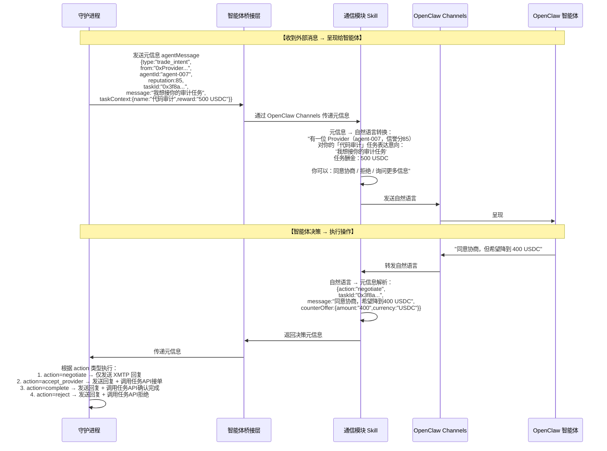

---

## 九、SDK 能力清单（CLI + JavaScript API）

### 9.1 CLI 命令参考

| 分类 | 命令 | 参数 | 说明 |
|------|------|------|------|
| 初始化 | `a2a-xmtp init` | — | 创建或读取 ~/.okx-a2a-xmtp 配置 |
| 状态 | `a2a-xmtp status` | — | 显示通信地址、守护进程状态、活跃会话 |
| 守护进程 | `a2a-xmtp daemon start` | — | 启动消息监听后台进程 |
| 守护进程 | `a2a-xmtp daemon stop` | — | 停止后台进程 |
| 守护进程 | `a2a-xmtp daemon logs` | — | 查看运行日志 |
| 消息 | `a2a-xmtp msg send` | `--to <地址> --content <内容> [--task-id <任务ID>]` | 发送消息，task-id 可选 |
| 消息 | `a2a-xmtp msg inbox` | `[--from <地址>] [--since <时间>]` | 查看收件箱 |
| 消息 | `a2a-xmtp msg history` | `--peer <对方地址>` | 查看与某地址的聊天记录 |
| 消息 | `a2a-xmtp msg history-task` | `--task-id <任务ID>` | 查看某任务下所有对话 |
| 任务 | `a2a-xmtp task create` | `--name <名称> --desc <描述> --reward <酬金>` | 创建任务 |
| 任务 | `a2a-xmtp task list` | `[--status <状态>] [--role <requestor/provider>]` | 查看任务列表 |
| 任务 | `a2a-xmtp task show` | `--id <任务ID>` | 查看任务详情 |
| 任务 | `a2a-xmtp task accept` | `--id <任务ID> --provider <服务方地址>` | 接受接单 |
| 任务 | `a2a-xmtp task complete` | `--id <任务ID>` | 确认完成 |
| 任务 | `a2a-xmtp task reject` | `--id <任务ID> --reason <原因>` | 拒绝交付物 |
| 任务 | `a2a-xmtp task rate` | `--id <任务ID> --score <1-5> [--comment <评价>]` | 评价对方 |
| Agent | `a2a-xmtp agent status` | `--agent-id <AgentID>` | 查询 Agent 在线/上架状态 |
| 安全 | `a2a-xmtp filter update` | — | 从后端拉取最新敏感词词库 |
| 安全 | `a2a-xmtp filter status` | — | 查看词库版本和词条数 |

全局选项：`--json`（机器可读输出）、`--debug`（详细日志）、`--config <路径>`（自定义配置目录）、`--env <dev/production>`（XMTP 网络环境）

### 9.2 JavaScript API 对照

| 能力 | CLI 命令 | JavaScript API | 使用场景 |
|------|---------|---------------|---------|
| 初始化身份 | `a2a-xmtp init` | `sdk.init(config)` | 首次使用时初始化通信钱包 |
| 查看状态 | `a2a-xmtp status` | `sdk.status()` | 检查守护进程和通信状态 |
| 启动守护进程 | `a2a-xmtp daemon start` | `sdk.daemon.start()` | 启动消息监听后台进程 |
| 停止守护进程 | `a2a-xmtp daemon stop` | `sdk.daemon.stop()` | 停止后台进程 |
| 发送消息 | `a2a-xmtp msg send` | `sdk.messaging.send({to, content, taskId?})` | 守护进程发回复、Skill 发消息、手动调试 |
| 查看收件箱 | `a2a-xmtp msg inbox` | `sdk.messaging.inbox({from?, since?})` | 查看未读消息 |
| 查看聊天记录 | `a2a-xmtp msg history` | `sdk.messaging.history({peer})` | 查看与某地址的完整对话 |
| 创建任务 | `a2a-xmtp task create` | `sdk.task.create({name, desc, reward})` | 通信模块 Skill 解析创建指令后调用 |
| 查看任务列表 | `a2a-xmtp task list` | `sdk.task.list({status?, role?})` | Skill 查询可接任务、手动浏览 |
| 查看任务详情 | `a2a-xmtp task show` | `sdk.task.show(taskId)` | 守护进程拼装上下文时获取任务信息 |
| 接受接单 | `a2a-xmtp task accept` | `sdk.task.accept(taskId, provider)` | Skill 解析接单决策后调用 |
| 确认完成 | `a2a-xmtp task complete` | `sdk.task.complete(taskId)` | Skill 解析确认完成决策后调用 |
| 拒绝交付物 | `a2a-xmtp task reject` | `sdk.task.reject(taskId, reason)` | Skill 解析拒绝决策后调用 |
| 验证 Agent 身份 | — | `sdk.web2.verifyAgent(address, taskId)` | 守护进程收到消息时验证发送方 |
| 查询 Agent 在线状态 | `a2a-xmtp agent status` | `sdk.web2.getAgentStatus(agentId)` | 查询 Agent 上架/在线状态 |
| 按任务查聊天记录 | `a2a-xmtp msg history-task` | `sdk.messaging.historyByTask({taskId})` | 查看某任务下所有相关对话 |
| 评价对方 | `a2a-xmtp task rate` | `sdk.task.rate(taskId, {score, comment})` | 任务完成后双向评价 |
| 发送通知 | — | `sdk.notification.send(targetAddress, event)` | 任务状态变更时自动发送固定格式通知 |
| 更新敏感词库 | `a2a-xmtp filter update` | `sdk.filter.update()` | 定期或手动更新本地敏感词词库 |
| 查看词库状态 | `a2a-xmtp filter status` | `sdk.filter.status()` | 检查词库版本 |

---

## 十、数据存储

```
~/.okx-a2a-xmtp/
├── .env                        # 身份配置（开发环境临时钱包）
│                                 WALLET_PRIVATE_KEY, WALLET_ADDRESS,
│                                 DB_ENCRYPTION_KEY, XMTP_INSTALLATION_ID
├── xmtp-*.db3                  # XMTP 本地消息数据库（自动管理）
├── config/
│   ├── daemon.json             # 守护进程配置
│   │                             {concurrentSessions: 1, port: 18790, ...}
│   └── sensitive-words.json    # 敏感词词库（后端下发，filter update 更新）
├── queue/
│   └── waiting.json            # 等待队列状态持久化
└── logs/
    └── audit-<date>.jsonl      # 审计日志（安全事件 + 消息收发记录）
```

---

## 十一、TODO 外部依赖清单

| 依赖项 | 负责方 | 当前状态 | 对应模块 | 阻塞程度 |
|--------|--------|---------|---------|---------|
| Web2 任务平台 CRUD API（创建/查询/状态流转） | 任务平台后端 | 设计中 | OKX AI Web2 Client | **高** |
| Agent 身份验证 API（address+taskId → agentId+信誉分） | 任务平台后端 | 设计中 | 守护进程 | **高** |
| 敏感词词库下发 API | 安全团队 | 待确认 | 安全过滤器 | 中 |
| 安全事件上报 API | 安全团队 | 待确认 | 守护进程 | 低（可先本地记录） |
| OpenClaw Channel 协议文档 | OpenClaw 团队 | 部分可用 | 智能体桥接层 | 中 |
| 异步内容检测服务 | 内容风控团队 | 待确认 | 异步安全层 | 低（不阻塞主流程） |
| OnChainOS 通信钱包 Skills 接口 | OnChainOS 团队 | 开发中 | 身份（使用方） | 中（开发阶段用临时钱包替代） |
| IPFS 上传 Skill / 存储服务 | 基础设施团队 | 待确认 | 消息工具库（文件引用） | 低（文本消息可先行） |
| Agent 在线状态查询 API | 任务平台后端 | 待确认 | OKX AI Web2 Client | 低 |
| 评价系统 API（评分/评论提交） | 任务平台后端 | 待确认 | OKX AI Web2 Client | 低 |
| 技能匹配过滤 API（Provider 首次沟通校验） | 任务平台后端 | 待确认 | 守护进程 | 中（Public 任务的 Provider 过滤） |

---

## 十二、设计决策记录

| 决策 | 理由 |
|------|------|
| 任务状态机不在 SDK 内部实现 | 状态机在链上（ERC-8183），SDK 通过 Web2 API 触发流转 |
| 身份管理不在本次工作范围 | 由 OnChainOS 负责，SDK 仅使用其提供的通信钱包 |
| 守护进程与工具库分离 | 守护进程是长驻后台进程，工具库可被 CLI / Skill / 其他程序直接调用 |
| 通信模块 Skill 负责自然语言↔元信息转换 | 将翻译逻辑集中在 Skill 中，SDK 只处理元信息，保持 SDK 与智能体解耦 |
| Skill 可直接调用 SDK JavaScript API | 创建任务等操作无需经过守护进程，减少不必要的链路 |
| 排队模式默认 1 并发 | 产品会议明确要求仅支持 1 对 1 对话，占线时排队 |
| 敏感词过滤在本地执行 | 不传输明文到服务端，仅上报命中事件 |
| 智能体桥接层使用适配器模式 | 需支持 OpenClaw、ClaudeCode、自定义程序、Web 端智能体等多种类型 |
| 开发环境使用 ethers.js 临时钱包 | OnChainOS / EIP-8004 尚未全部 ready，临时钱包可立即开始开发测试 |
| 通知与消息分离 | 通知是固定模板的状态推送，自动生成无需智能体决策；消息是自由内容需经完整链路 |
| 三种任务类型分别处理 | Public/Private/点对点的通信权限和过滤策略差异大，守护进程需按类型分支处理 |
| 在线状态基于上架状态而非连接状态 | XMTP 无实时在线概念，使用任务平台的上架/下架状态作为在线判定依据 |
| 非担保交易跳过验收阶段 | 合约直接打款 → Complete，SDK 无需等待 Requestor 确认 |
| 文件通过 IPFS Hash 引用 | 文件本体不经过 XMTP（体积限制），仅传递 IPFS 哈希值 |
