# OKX A2A XMTP SDK — Mermaid 图源码（中英双语版）

> 使用方法：在飞书文档中删除对应位置的 Plaintext 代码块，插入"文本绘图"组件，粘贴下方源码。

---

## 图 1：1.1 战略设计 — 限界上下文划分

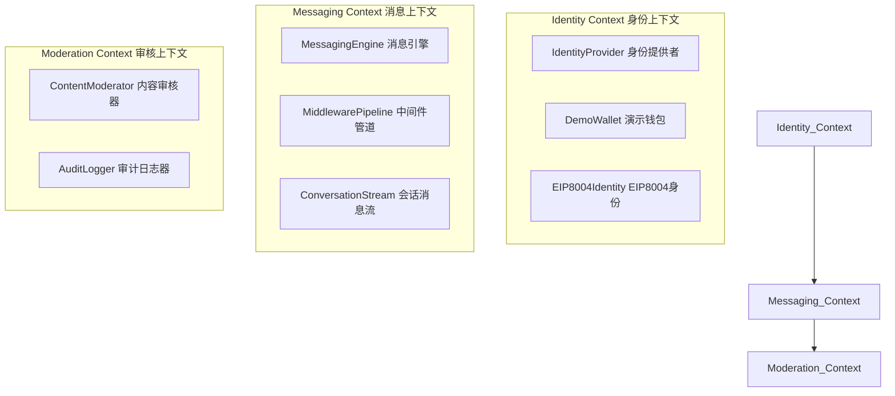

---

## 图 2：1.2 核心领域实体与值对象

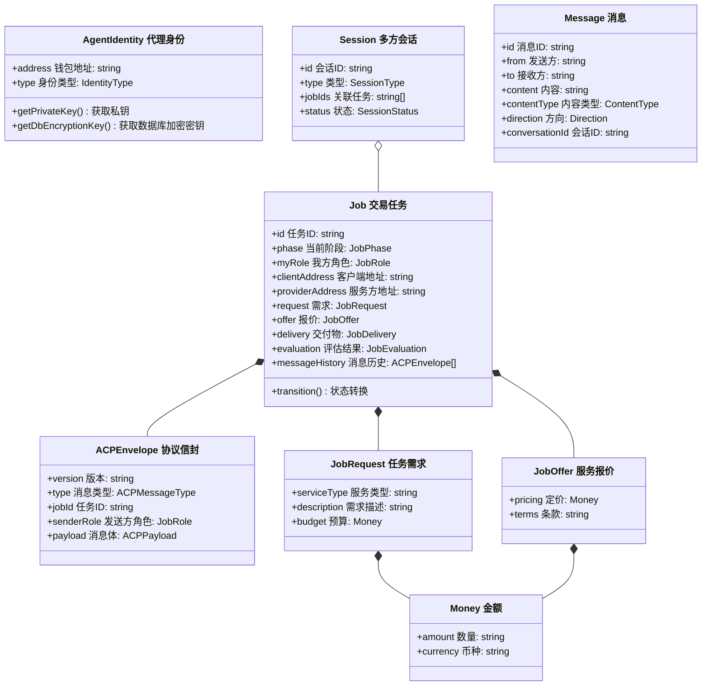

---

## 图 3：1.3 系统分层架构

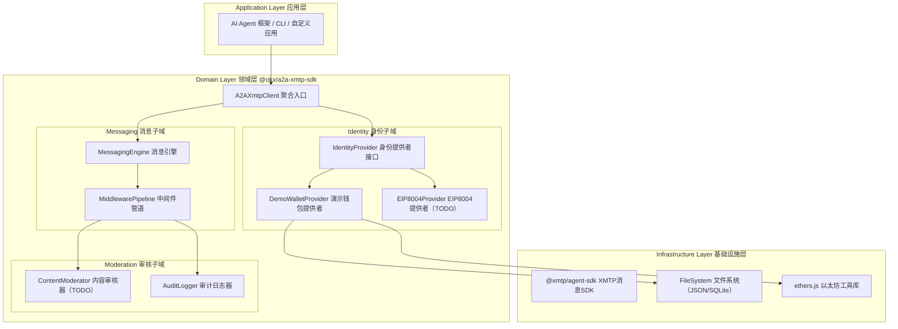

---

## 图 4：2.1 身份提供者类图

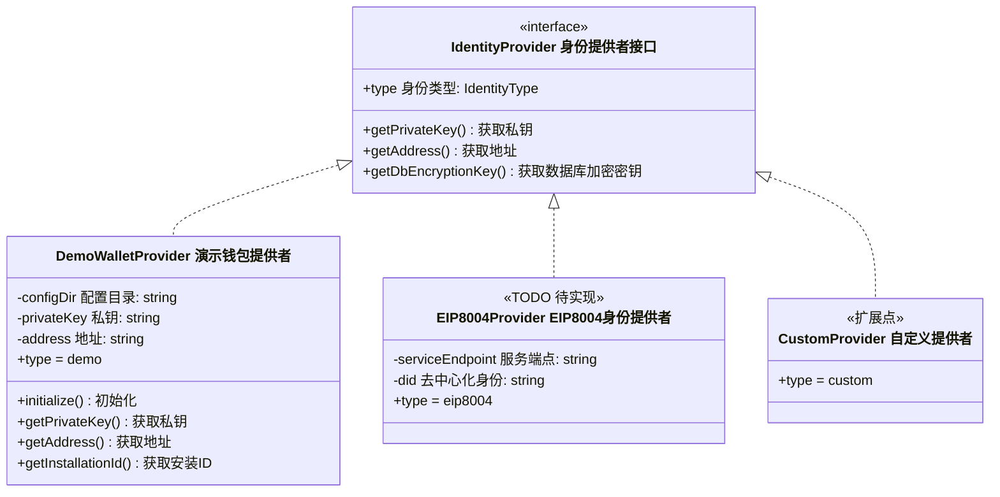

---

## 图 5：2.2 Demo 身份初始化流程

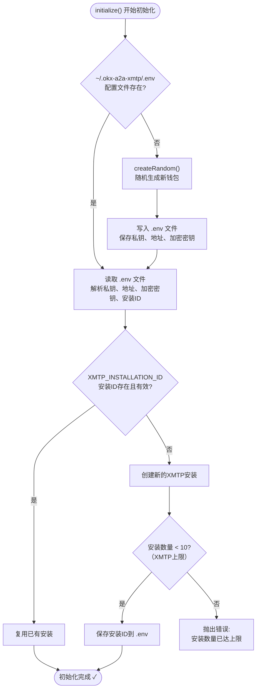

---

## 图 6：3.1 消息流转时序图

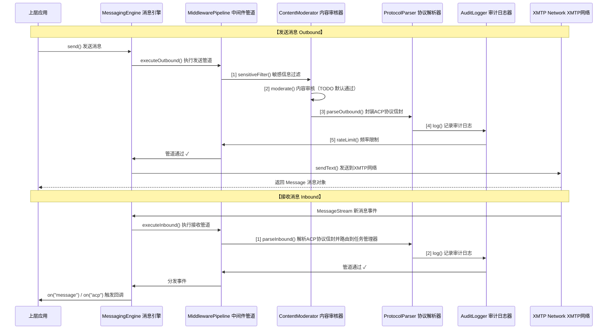

---

## 图 7：3.2 中间件管道架构

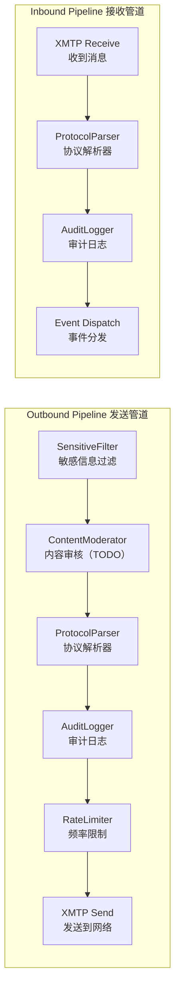

---

## 图 8：4.3 ACP 消息 Scheme（协议消息结构）

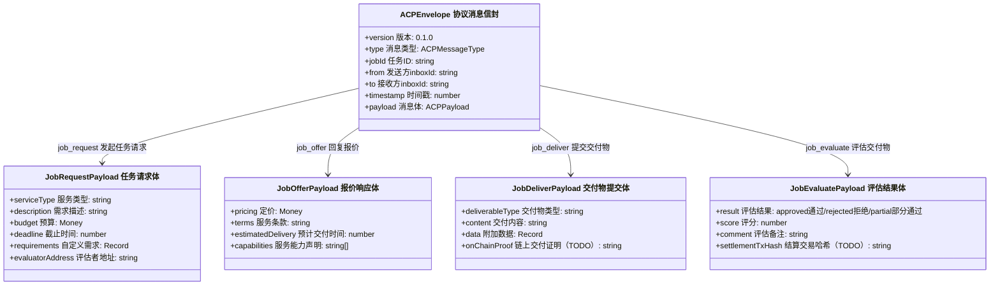

---

## 图 10：5.1 一对多广播交易流程

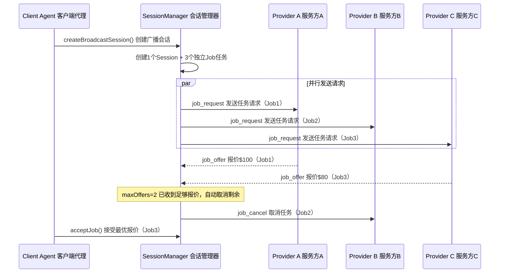

---

## 图 11：5.2 多对一多客户端场景

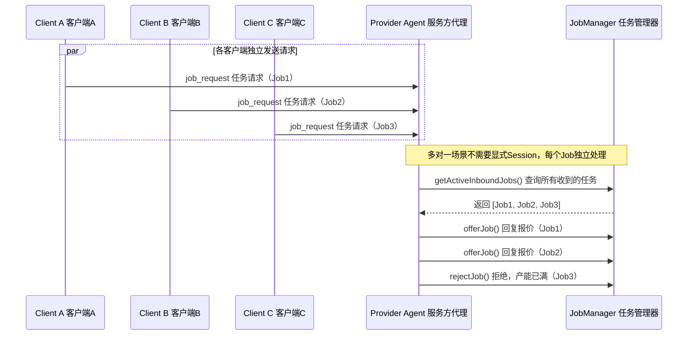

---

## 图 12：六、ACP 完整交易时序图

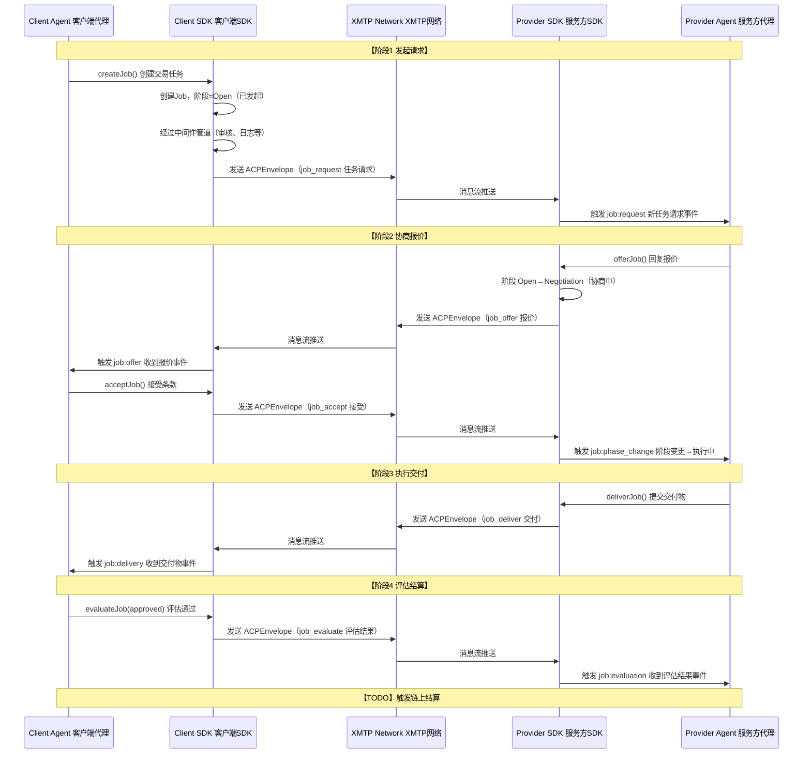

---

## 图 13：7.2 启动恢复流程

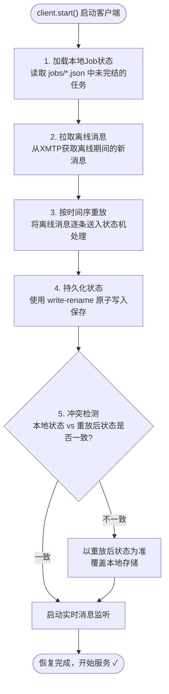

---

## 图 14：8.1 CLI 命令树

```mermaid
graph TD
    CLI["a2a-xmtp 命令行工具"]
    CLI --> INIT["init 初始化身份"]
    CLI --> STATUS["status 查看运行状态"]
    CLI --> MSG["消息操作"]
    MSG --> SEND["send 发送消息\n--to 目标地址 --msg 消息内容"]
    MSG --> REPLY["reply 回复消息\n--conv 会话ID --msg 消息内容"]
    MSG --> INBOX["inbox 查看收件箱\n--from 发送方 --since 起始时间"]
    MSG --> HISTORY["history 查看聊天记录\n--peer 对方地址"]
    CLI --> JOB["交易操作"]
    JOB --> JC["job create 创建交易任务\n--to --service --desc"]
    JOB --> JL["job list 列出任务\n--phase --role"]
    JOB --> JS["job show 查看任务详情"]
    JOB --> JO["job offer 回复报价\n--price --terms"]
    JOB --> JA["job accept 接受条款"]
    JOB --> JR["job reject 拒绝\n--reason"]
    JOB --> JD["job deliver 提交交付物\n--type --content"]
    JOB --> JE["job evaluate 评估交付物\n--result"]
    CLI --> SESSION["会话操作"]
    SESSION --> SB["session broadcast 广播询价\n--to --service"]
    SESSION --> SL["session list 列出会话"]
    SESSION --> SC["session cancel 取消会话"]
```

---

## 图 15：9.1 聚合入口结构

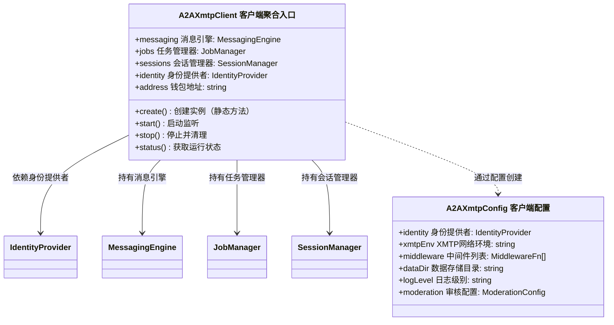
